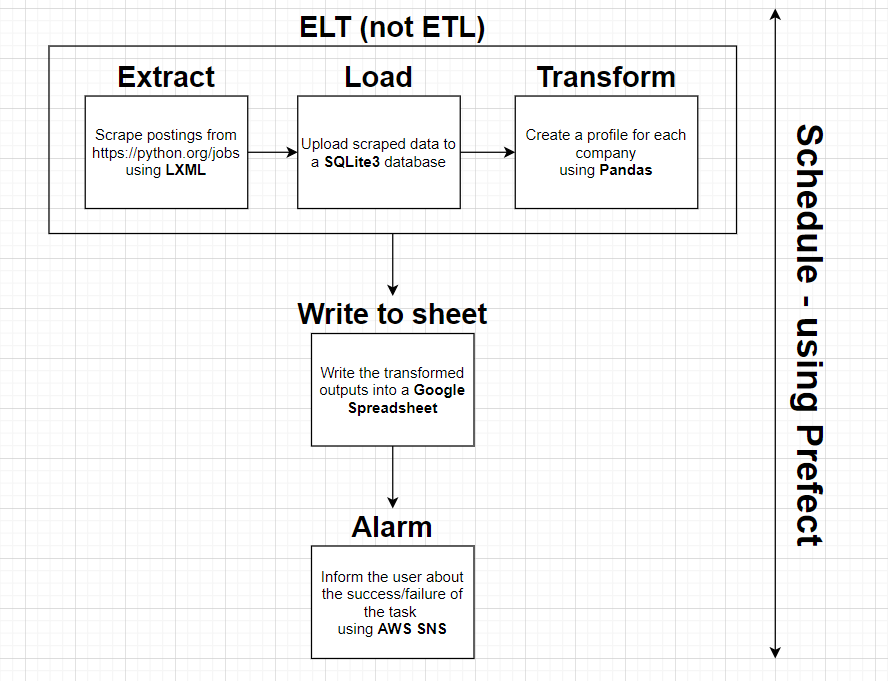
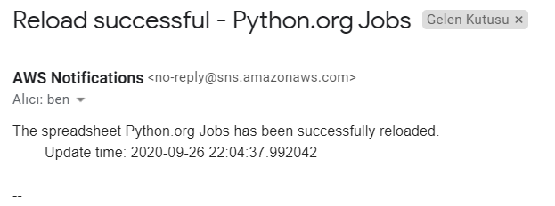
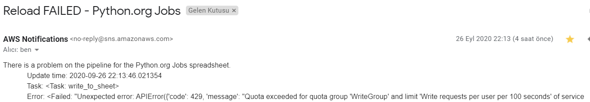

# smol-elt (not ETL)
just a smol elt pipeline

u can use it as a template or a sample to look at

see how it works down there 👇

## Sample Output
**Demo video** 
- https://www.youtube.com/watch?v=vEtckC8HS04

**Spreadsheet**
- https://docs.google.com/spreadsheets/d/1ByKu9j9e-R-N9O83Zszbrlb_3KBwyR5p2V743Vau3F8/edit#gid=0

### Alert Messages
#### Success

#### Failure

# How can I adjust smol-elt to my use case?
- Clone the repository
- Install the needed packages
    - `pip install -r requirements.txt`
- Create credentials for Google Sheets API
    - https://gspread.readthedocs.io/en/latest/oauth2.html
    - Follow the instructions below the `For Bots` part
    - Save the output as `smol/credentials/gsheet_credentials.json`
- Create credentials for AWS
    - Open an AWS account if you don't have it
    - Create an IAM user with `AmazonSNSFullAccess` policy
    - Get your security credentials
    - Save your credentials with the given format in `smol/credentials/aws_credentials.json`
- Configure SNS
    - Create an SNS topic and subscribe your e-mail address to that topic
- Edit files for your use case
    - Create your own pipeline by using ours as a sample
    - Change the schedule in tasks.py according to your needs
- Run `tests/run_tests.py` to automatically test the ELT part
- Run `smol/run.py` to use the pipeline
